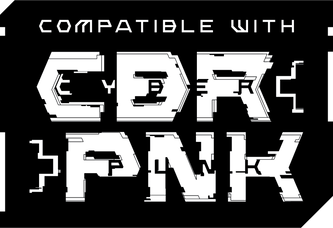

# CBR+PNK Roller

An unofficial dice roller for CBR+PNK in FoundryVTT, based on code by Megastruktur and drewg13 

## Usage

Use the FD icon at the bottom of the taskbar. 
Pick your dice pool, glitch count, threat, and effect, then roll. 

OR

Use the shortcut key to bring up the dialog, set to 'R' by default.

## Settings

There are module settings for controlling: 
- the max number of dice 
- the default number of dice initially selected 
- the default number of dice to set as glitchy 
- the default threat initially selected 
- the default effect initially selected 
- the new GUI interface (currently disabled) 

## Macro usage

You can trigger the Dialog using `game.cpnkroller.FitDRollerPopup()` 
You can also call the roller directly with `game.cpnkroller.FitDRoller(attribute,dice_amount,position,effect,purpose,glitch)` 
`attribute` = can be any string (defaults to "") 
`dice` = total number of dice to roll (defaults to 0) 
`position` = accepts integers from 0-4 (defaults to Threat 2 if you enter anything else) 
`effect` = accepts integers from 0-4 (defaults to Effect 2 if you enter anything else) 
`glitch` = number of glitchy dice 

## Attribution
This work is based on [Blades in the Dark](http://www.bladesinthedark.com/), product of One Seven Design, developed and authored by John Harper, and licensed for use under the [Creative Commons Attribution 3.0 Unported license](http://creativecommons.org/licenses/by/3.0/).

Published independently under the '[CBR+PNK Compatibility License](https://emanoelmelo.itch.io/cbrpnk-toolkit)' with no association with Emanoel Melo, The Cabinet of Curiosities, Mythworks, or other official publishers of CBR+PNK.

'CBR+PNK' and its associated logos and iconography are copyright Emanoel Melo and are used with permission.
